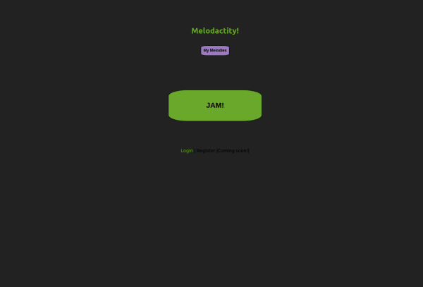
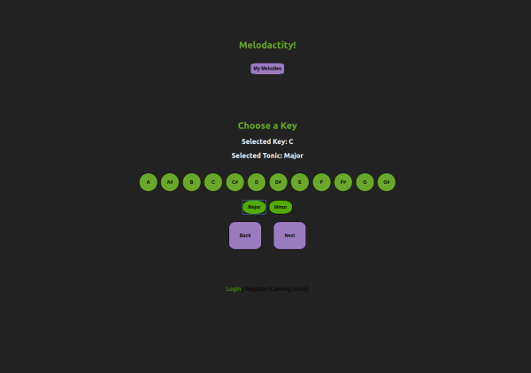
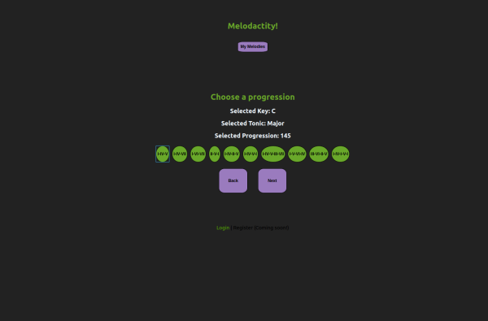
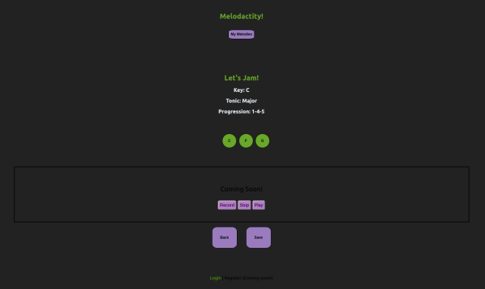
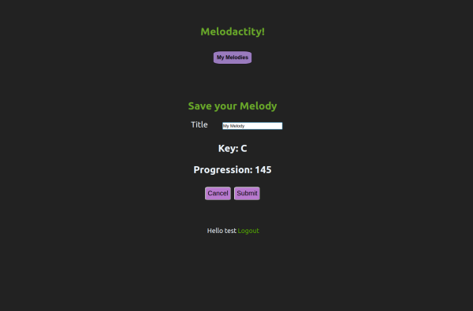
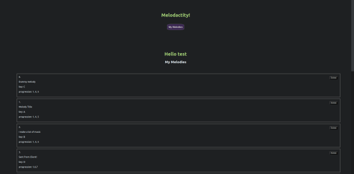

# Melodacity

https://melodacity.now.sh/

An app designed for musicians, songwriters, and those who like to create stuff.
 

:musical_note: Create an account/login or simply create without saving.

:musical_note: Select a key and a progression, then see the chords it contains

:musical_note: (In progress) Press the buttons to hear sounds and create melodies

:musical_note: (In progress) Record a melody and play it back!

:musical_note: Save recordings to hear them again later

:musical_note: View all my previous recordings on my personal profile

**************************************************************

**************************************************************
**Technologies:**
React, HTML, CSS, NodeJS, Express, PostgreSQL, 

