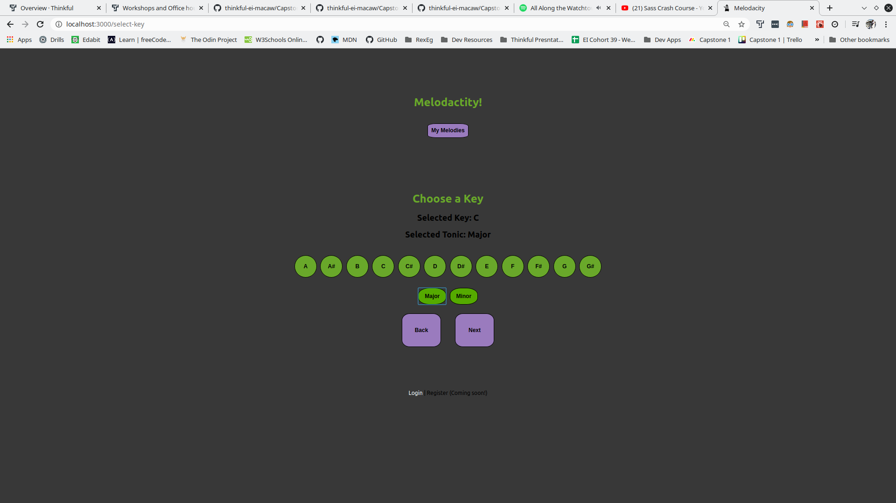
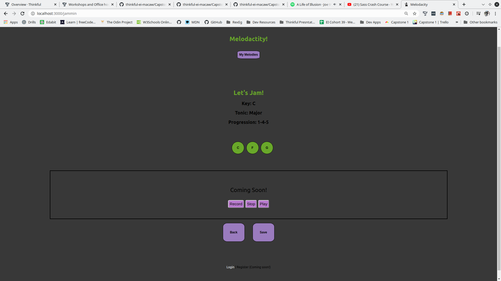
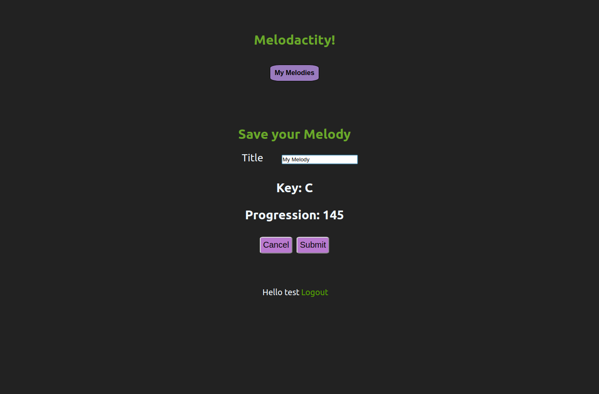
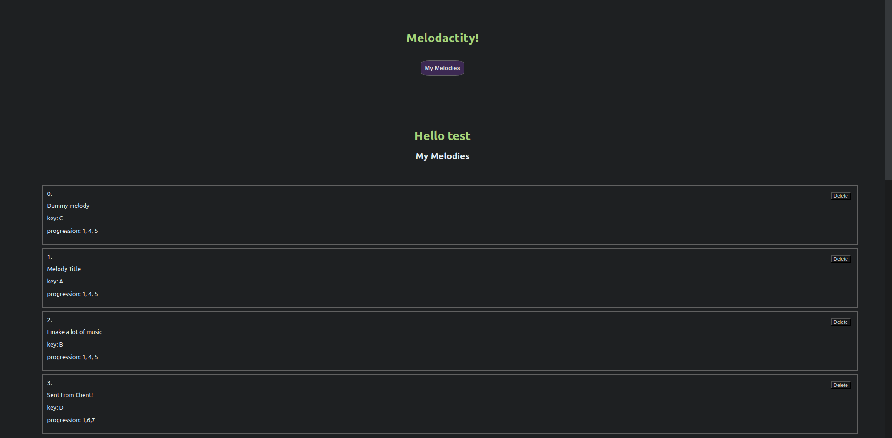

# Melodacity

https://melodacity.now.sh/

An app designed for musicians, songwriters, and those who like to create stuff.
 
Progress board: https://trello.com/b/wHnyMjOi/capstone-1

:musical_keyboard: **As a user, I can:**

:musical_note: Choose to create an account/login or simply create without saving.

:musical_note: Select a key and a progression, then see the notes and chords it contains

:musical_note: (In progress) Press the buttons to hear sounds and create melodies

:musical_note: (In progress) Record a melody and play it back!

:musical_keyboard: **With an account, I can:**

:musical_note: Save my recordings to hear them again later

:musical_note: View all my previous recordings on my personal profile

:musical_note: Delete my recordings

**************************************************************

This project was bootstrapped with [Create React App](https://github.com/facebook/create-react-app).

## Available Scripts

In the project directory, you can run:

### `npm start`

Runs the app in the development mode. 
Open [http://localhost:3000](http://localhost:3000) to view it in the browser.

